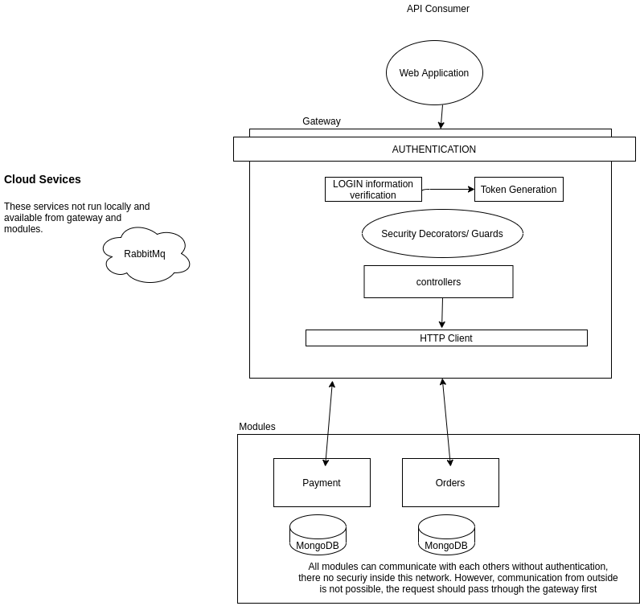

# Order and Payment App

    Overview: Manage order and payment

## Technologies used

    - NestJS
    - Docker
    - RabbmitMQ (via @briohr/nest-broker)(WIP)
    - JWT
    - Mongoose
    - Microservices

### Gateway Feature Explanation

This is the single entry point of this app APIs. - Handle authentication, users, roles, security. - Redirect HTTP traffic to specific services using HttpClients

#### Authentication

At gateway level, JWT is being used as authentication strategies. There will `Guard` added to the controller to enforce the authentication

##### Security

To secure some controller to suit the user role, `HasRole` decorator and its associated `Guard`, `RoleGuard` has been added.
